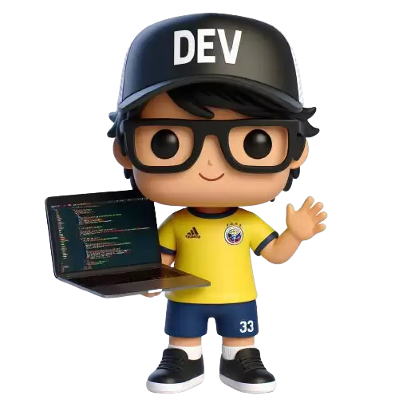

  

    
  

  

    
  

<!-- How To Connect With Me -->

  <!--  -->
   
  
  
  
  
  

<!-- #Hiii there 👋 -->

### Hello there  my name is Pawan and I am a Web developer

Passionate Front-End Developer dedicated to crafting stunning and user-friendly web interfaces. Thrives on continuous learning and thrives in a collaborative startup environment, eager to make impactful contributions to the team.

<!-- ### 🎯 Some technologies I use: -->

<h2 align="center">Skills & Tools</h2>

 

 <!-- ## About Me -->

- 📆 I’m currently working on... Cool projects
- 🌱 I’m currently learning ... ⚡ JavaScript frameworks & PHP
- 💬 Ask me about ** PHP, Wordpress, HTML, CSS, Javascript **
- 🤔 I’m looking for guidance in... Breaking into the front-end development industry.
- 🎮 I'm passionate about... Web Development & Never Stop Learning.
- ⚡ Fun fact: Developers often joke that the best code is the one you wrote a year ago and can still understand!
<!-- - 👯 I’m looking to collaborate on...
- 📝 write
- 🌐 Proud member.
- ✍️ Content Writer.
- 🤔 I’m looking for help with...  -->

<table>
  <tr>
    <th></th>
    <th></th>
    <th></th>
  </tr>
</table>

<table>
  <tr>
    <th>
    </th>
    <th>
    </th>
  </tr>
</table>

#### Top Repositories

<!-- **************** RESOURCES *************** -->

<!--  - icons...  https://simpleicons.org/ | https://devicon.dev/ |   https://gist.github.com/rxaviers/7360908
  - Company logos...    https://home.aveek.io/GitHub-Profile-Badges/
  Github Generators....
  https://gprm.itsvg.in/  |  https://rahuldkjain.github.io/gh-profile-readme-generator/ -->
